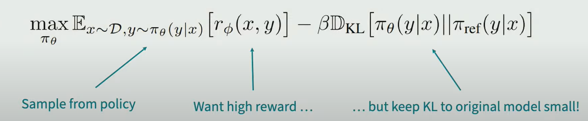
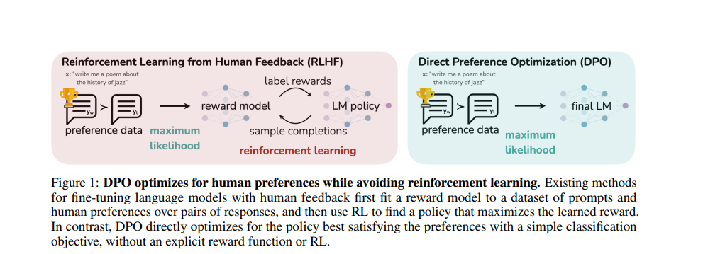

# RLHF_LLM

## The SFT + RL Process
Start with Pretrained models. why do they need to be finetuned?

To follow instructions and be useful.

To do that there is a 3 step process:

#### Supervised Fine-tuning

Pre-trained Large language models masters the statistical regularities of language. However, they do not possess specific knowledge about particular domains. To bridge this gap, Fine-tuning allows the model to acquire specialized knowledge and adapt its behavior to better serve specific applications, making it more useful and reliable.

Core to starting the RLHF process is having a model that responds well to diverse instructions.

#### Reward model training
The underlying goal is to get a model or system that takes in a sequence of text, and returns a scalar reward which should numerically represent the human preference. 
The system can be an end-to-end LM, or a modular system outputting a reward. An intuition would be that these preference models need to have similar capacity to understand the text given to them as a model would need in order to generate said text.

The training dataset for RM is generated by sampling a set of prompts, then using the instruction tuned LLM (with may be other LLMs) to generate multiple outputs.
Human annotators are used to rank the generated text outputs from the LM. ranking has benn proven to be a better choice to define preference than giving scalar values. Then, the ranking is normalized into a scalar reward signal for training.

This  is done thanks to the Bradley Terry model that can infer scores given an observed set of outcomes (ranked outputs in our case):

Then, the preference model is trained by minimizing a negative likelihood over the scores of winner vs loser answer:

At this point in the RLHF system, we have a preference model that takes in any text and assigns it a score of how well humans perceive it.

#### Fine-tuning with RL

In this step we learn a policy achieving a high reward assigned by the reward model (model trained above that represents goodness according to humans).
This policy is defined by the equation below:

This step is essentially about fine-tuning some or all of the parameters of a copy of the initial LM with a policy-gradient RL algorithm.

PPO has been around for a relatively long time. The relative maturity of this method made it a favorable choice for this step and scaling up to the new application of distributed training for RLHF.

## The PPO method

Traditional method:
- Use an auxiliary reward model and fine-tune the model of interest so that it maximizes this given reward via the machinery of RL and it generates high-reward samples more often and low-reward samples less often

How it works?
- The policy is a language model that takes in a prompt and returns a sequence of text
- The action space of this policy is all the tokens corresponding to the vocabulary of the language model (often on the order of 50k tokens)
- The observation space is the distribution of possible input token sequences
- The reward function is a combination of the preference model and a constraint on policy shift

Given a prompt x, the text y is generated. (x,y) are passed to the RM, which returns a scalar notion of “preferability” rθ.

In addition, per-token probability distributions from the RL policy are compared to the ones from the initial model to compute a penalty on the difference between them. this penalty has been designed as a scaled version of the Kullback–Leibler (KL) divergence between these sequences of distributions over tokens rKL.

The final reward sent to the RL update rule is r=rθ−λrKL.

​The PPO is a :
- complex method
- unstable
- lots of computational ressources 

The scale of data used in training the reward model for most applications of RLHF (~50k labeled preference samples) is still expensive (not as expensive as the data nedded to be generated for pretraining). However, it is still a higher cost than academic labs would likely be able to afford.

## The DPO method

In the Direct Preference Optimization (DPO) [Paper](https://arxiv.org/pdf/2305.18290.pdf), we leverage a mapping between reward functions and optimal policies to show that this constrained reward maximization problem can be optimized exactly with a single stage of policy training, essentially solving a classification problem on the human preference data.

The RL-based objective used by traditional methods like PPO can be optimized exactly with a simple binary cross-entropy objective, greatly simplifying the preference learning pipeline, getting rid of explicit reward modeling or reinforcement learning.

What happened actually is that the DPO objective was derived from the RL general objective defined above using a change-of-variables approach, which gives this form:

[HF Blog article](https://huggingface.co/blog/dpo-trl)

## The KTO method

Like most alignment methods, DPO requires a dataset of paired preferences where annotators label which response is better according to a set of criteria like helpfulness or harmfulness. In practice, creating these datasets is a time consuming and costly endeavour. ContextualAI recently proposed an interesting alternative called Kahneman-Tversky Optimisation (KTO), which defines the loss function entirely in terms of individual examples that have been labelled as "good" or "bad" (for example, the 👍 or 👎 icons one sees in chat UIs). These labels are much easier to acquire in practice and KTO is a promising way to continually update chat models running in production environments.

Check out this [HF Blog article](https://huggingface.co/blog/pref-tuning) that compares between the different alignement methods.

Cheat notebooks for RLHF tuning :
- Checkout this [Colab notebook about finetuning Mistral7B with DPO](https://colab.research.google.com/drive/15iFBr1xWgztXvhrj5I9fBv20c7CFOPBE?usp=sharing)
